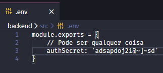

# Curso de React + Redux

Aplicação my-money-app:
  - Para o funcionamento da aplicação, dentro da pasta backend/src. Deverá conter um arquivo ".env" e dentro desse arquivo, um export com a propriedade "authSecret" para realizar a autenticação da api. Conforme exemplo abaixo:

